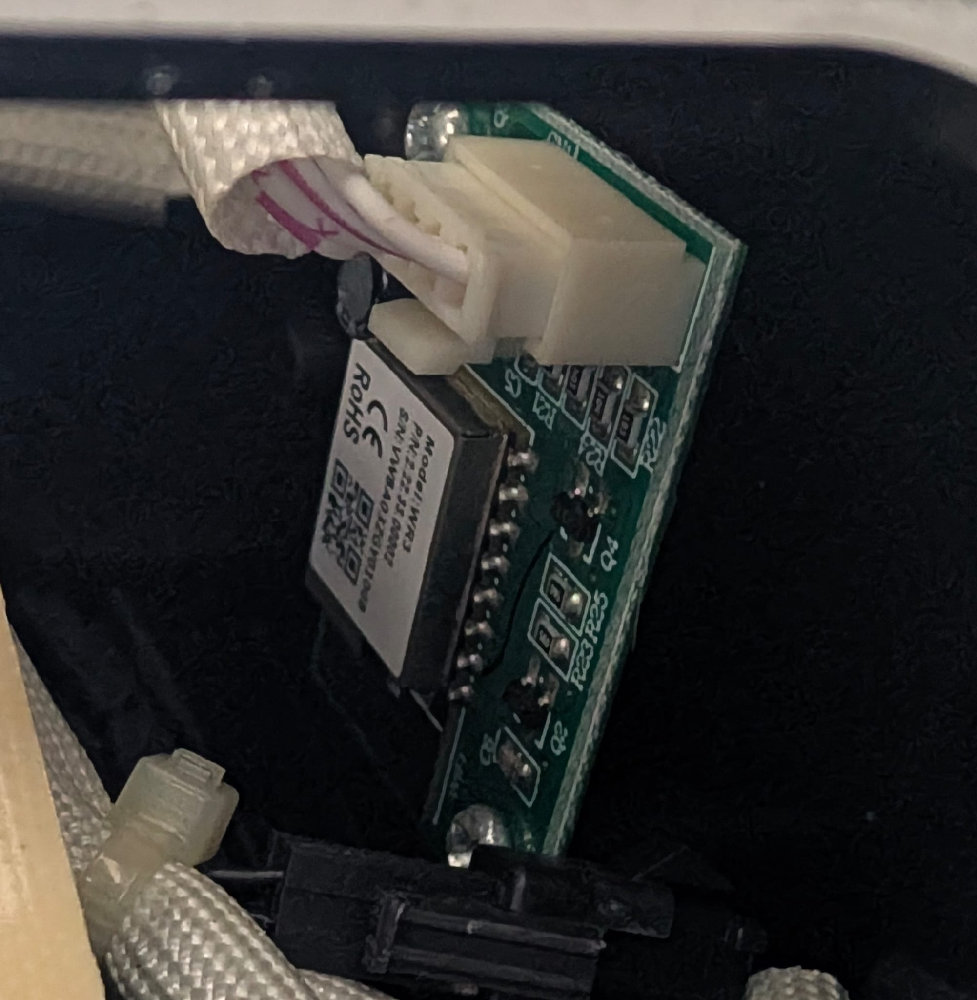
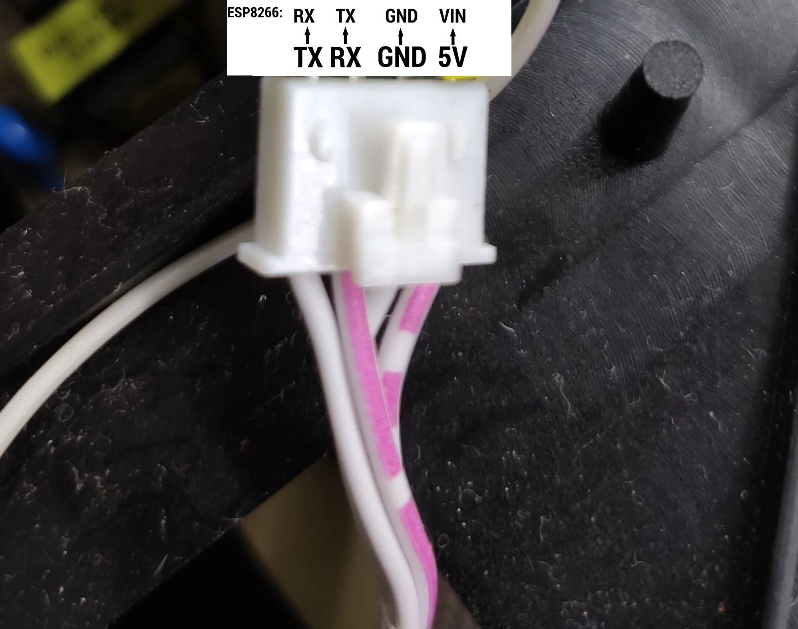
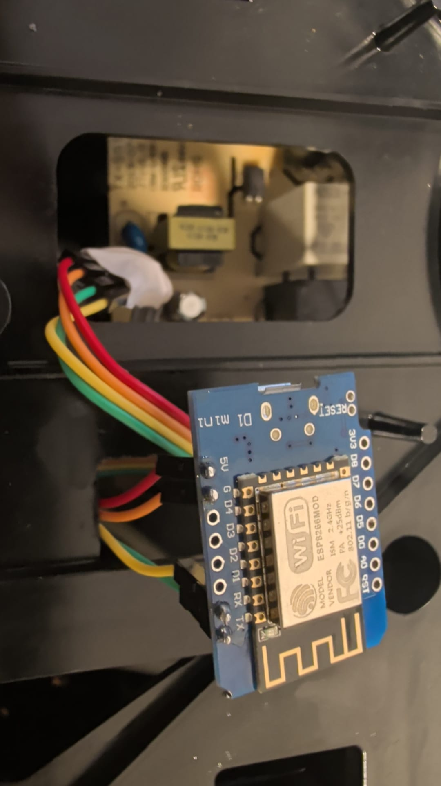

# Proscenic T21 ESPHome

Gracias a [Blakadder](https://blakadder.com/) por investigar la Proscenic T21, identificar sus datapoints y publicar la [idea original para sustituir el módulo Wi-Fi](https://templates.blakadder.com/proscenic_T21.html). Este proyecto adapta aquel trabajo a ESPHome y a la API nativa de Home Assistant.

Thanks to [Blakadder](https://blakadder.com/) for researching the Proscenic T21, identifying its datapoints, and publishing the [original Wi-Fi module replacement idea](https://templates.blakadder.com/proscenic_T21.html). This project adapts that work to ESPHome and Home Assistant's native API.

[Español](#español) · [English](#english)

## Español

Integración local de la freidora de aire Proscenic T21 mediante ESPHome. Sustituye la placa Wi-Fi WR3 original por una placa ESP8266 y expone en Home Assistant todos los estados y controles identificados.

Probada físicamente con un Wemos D1 Mini, ESPHome 2026.8.2 y Home Assistant 2026.9.1. No utiliza la nube de Proscenic, Alexa, MQTT, HACS ni `external_components`.

### Funciones disponibles

- Encendido y apagado.
- Inicio y pausa de la cocción.
- Selección de programa: ninguno, patatas, gambas, pizza, pollo, pescado, filete, muffin, bacon, precalentar y personalizado.
- Ajuste del tiempo de cocción.
- Ajuste de temperatura en Celsius o Fahrenheit, siempre con valores enteros.
- Inicio diferido y ajuste de su duración.
- Mantener caliente y ajuste de su duración.
- Estado de cocción, programa activo, cesta, temperatura interna, temperatura configurada y tiempo restante.
- Diagnóstico de conexión, señal Wi-Fi, tiempo encendido, versión y código de error.

Los iconos se han asignado según la función, siguiendo la disposición de la [ficha creada por Blakadder](https://blakadder.com/proscenic-in-home-assistant/).

### Material necesario

- Un Wemos D1 Mini, NodeMCU u otra placa ESP8266 equivalente alimentable a 5 V.
- Cuatro cables Dupont macho-macho.
- Un cable USB para el primer flasheo.
- Una herramienta fina de plástico para liberar la tapa superior.

No es necesario desoldar el módulo WR3. La placa Wi-Fi original está separada de la placa principal y utiliza un conector de cuatro pines PH2.54.

### Acceso a la placa Wi-Fi

1. Desenchufa completamente la freidora.
2. Saca la tapa superior, que va sujeta a presión mediante clips de plástico.
3. Localiza la pequeña placa Wi-Fi WR3.
4. Desconecta su conector PH2.54 de cuatro pines.
5. Conserva la placa original por si quieres restaurar el aparato.

<p align="center"></p>

### Cableado

Conecta los cuatro cables cruzando TX y RX:

| Conector PH2.54 de la freidora | Wemos D1 Mini / NodeMCU |
| --- | --- |
| TX de la MCU | RX / GPIO3 |
| RX de la MCU | TX / GPIO1 |
| GND | G / GND |
| 5 V | 5V / VIN |

<p align="center"></p>

Identifica los pines por su posición y función; los colores de los cables pueden variar. En la unidad probada se verificó el orden con un multímetro. No conectes 5 V al pin `3V3`.

Realiza el primer flasheo por USB con el ESP8266 separado de la freidora. Desconecta el USB antes de conectarlo al PH2.54. No alimentes la placa simultáneamente desde el USB y desde la freidora.

<p align="center"></p>

### Elegir idioma y temperatura

Hay cuatro paquetes preparados:

| Idioma | Temperatura | Archivo |
| --- | --- | --- |
| Español | Celsius, 77–204 °C | `packages/proscenic-t21-es-celsius.yaml` |
| Español | Fahrenheit, 170–400 °F | `packages/proscenic-t21-es-fahrenheit.yaml` |
| English | Celsius, 77–204 °C | `packages/proscenic-t21-en-celsius.yaml` |
| English | Fahrenheit, 170–400 °F | `packages/proscenic-t21-en-fahrenheit.yaml` |

`packages/proscenic-t21.yaml` se mantiene como alias compatible de la variante en español y Celsius.

### Instalación en ESPHome Device Builder

1. Crea un dispositivo ESP8266 en ESPHome Device Builder.
2. Conserva el nombre, la Wi-Fi, la clave de cifrado de la API y la contraseña OTA generadas.
3. Añade el paquete elegido dentro de `packages:`. Este ejemplo usa español y Celsius:

```yaml
esphome:
  name: proscenic-t21
  friendly_name: Proscenic T21

packages:
  t21: github://micasadomotica/proscenic-t21-esphome/packages/proscenic-t21-es-celsius.yaml@v1.0.0

wifi:
  ssid: !secret wifi_ssid
  password: !secret wifi_password

api:
  encryption:
    key: !secret t21_api_key

ota:
  - platform: esphome
    password: !secret t21_ota_password
```

También puedes copiar uno de los cuatro archivos completos de la carpeta [`examples`](examples). La etiqueta `v1.0.0` fija una versión probada. Sustitúyela por `main` únicamente si quieres recibir los cambios más recientes al recompilar.

Para usar un NodeMCU, añade al YAML principal:

```yaml
esp8266:
  board: nodemcuv2
```

En otras placas ESP8266 utiliza el identificador de placa correspondiente. GPIO1 y GPIO3 deben quedar disponibles para la UART.

4. Valida el YAML y realiza el primer flasheo por USB.
5. Desconecta el USB, instala el ESP8266 en la freidora y enciéndela.
6. Comprueba que el dispositivo aparece en línea y añádelo mediante la integración ESPHome de Home Assistant.

El registro serie está desactivado porque GPIO1 y GPIO3 transportan el protocolo Tuya. Los registros de ESPHome y Tuya quedan en nivel `INFO` y se consultan por Wi-Fi.

### Mapa de datapoints

| DP | Función |
| --- | --- |
| 1 | Encendido |
| 2 | Iniciar o pausar cocción |
| 3 | Programa |
| 5 | Estado de cocción |
| 6 | Minutos de inicio diferido, 5–720 |
| 7 | Tiempo de cocción, 1–60 minutos |
| 8 | Tiempo restante |
| 12 | Código de error |
| 102 | Cesta retirada |
| 103 | Temperatura configurada; la MCU utiliza Fahrenheit |
| 104 | Mantener caliente |
| 105 | Duración de mantener caliente |
| 106 | Activar inicio diferido |
| 107 | Temperatura interna; la MCU utiliza Celsius |

Los DP10, DP108 y DP109 siguen sin exponerse porque su función no está identificada. Los controles esperan la confirmación de la MCU y no usan estado optimista.

### Validación

- Las cuatro variantes superan la validación de ESPHome 2026.8.2.
- Comunicación Tuya MCU estable a 9600 baudios, 8N1, por GPIO1/GPIO3.
- Product ID observado: `ngdn90sk1yqmk9ww`, firmware MCU `1.0.2`.
- Lectura y escritura verificadas físicamente para programas, estados, cesta, temperaturas, tiempos, encendido, inicio/pausa, inicio diferido y mantener caliente.
- Conversión bidireccional de temperatura: la freidora recibe DP103 en Fahrenheit y Home Assistant utiliza la unidad elegida con pasos enteros.

## English

Local ESPHome integration for the Proscenic T21 air fryer. It replaces the original WR3 Wi-Fi board with an ESP8266 board and exposes every identified state and control in Home Assistant.

Physically tested with a Wemos D1 Mini, ESPHome 2026.8.2, and Home Assistant 2026.9.1. It does not require the Proscenic cloud, Alexa, MQTT, HACS, or `external_components`.

### Available features

- Fryer power.
- Start and pause cooking.
- Program selection: none, fries, shrimp, pizza, chicken, fish, steak, muffin, bacon, preheat, and custom.
- Cooking time control.
- Temperature control in Celsius or Fahrenheit using whole numbers.
- Delayed cooking and delay time control.
- Keep warm and keep warm time control.
- Cooking state, active program, basket state, internal temperature, target temperature, and remaining time.
- Connection, Wi-Fi signal, uptime, ESPHome version, and error diagnostics.

Icons are assigned by function following the layout of [Blakadder's Home Assistant device card](https://blakadder.com/proscenic-in-home-assistant/).

### Required parts

- A Wemos D1 Mini, NodeMCU, or similar 5 V powered ESP8266 board.
- Four male-to-male Dupont wires.
- A USB cable for the initial flash.
- A thin plastic prying tool for the top cover.

The WR3 module does not need to be desoldered. The original Wi-Fi board is separate from the main board and connects through a four-pin PH2.54 connector.

### Accessing the Wi-Fi board

1. Unplug the air fryer completely.
2. Release the pressure-fit top cover from its plastic clips.
3. Locate the small WR3 Wi-Fi board.
4. Unplug its four-pin PH2.54 connector.
5. Keep the original board in case you want to restore the appliance.

<p align="center"></p>

### Wiring

Use the four wires and cross TX and RX:

| Air fryer PH2.54 connector | Wemos D1 Mini / NodeMCU |
| --- | --- |
| MCU TX | RX / GPIO3 |
| MCU RX | TX / GPIO1 |
| GND | G / GND |
| 5 V | 5V / VIN |

<p align="center"></p>

Identify the pins by position and function because wire colors may differ. The order was checked with a multimeter on the tested unit. Never connect 5 V to the `3V3` pin.

Perform the first USB flash while the ESP8266 is disconnected from the air fryer. Unplug USB before connecting the PH2.54 cable. Do not power the board from USB and the air fryer at the same time.

<p align="center"></p>

### Language and temperature choices

Four ready-to-use packages are provided:

| Language | Temperature | File |
| --- | --- | --- |
| Español | Celsius, 77–204 °C | `packages/proscenic-t21-es-celsius.yaml` |
| Español | Fahrenheit, 170–400 °F | `packages/proscenic-t21-es-fahrenheit.yaml` |
| English | Celsius, 77–204 °C | `packages/proscenic-t21-en-celsius.yaml` |
| English | Fahrenheit, 170–400 °F | `packages/proscenic-t21-en-fahrenheit.yaml` |

`packages/proscenic-t21.yaml` remains a backward-compatible alias for Spanish with Celsius.

### ESPHome Device Builder installation

1. Create an ESP8266 device in ESPHome Device Builder.
2. Keep the generated device name, Wi-Fi configuration, API encryption key, and OTA password.
3. Add the selected package under `packages:`. This example uses English with Fahrenheit:

```yaml
esphome:
  name: proscenic-t21
  friendly_name: Proscenic T21

packages:
  t21: github://micasadomotica/proscenic-t21-esphome/packages/proscenic-t21-en-fahrenheit.yaml@v1.0.0

wifi:
  ssid: !secret wifi_ssid
  password: !secret wifi_password

api:
  encryption:
    key: !secret t21_api_key

ota:
  - platform: esphome
    password: !secret t21_ota_password
```

You can also copy one of the four complete files from the [`examples`](examples) directory. The `v1.0.0` tag pins a tested release. Replace it with `main` only if you want the newest changes whenever you compile.

For a NodeMCU, add this to the main YAML:

```yaml
esp8266:
  board: nodemcuv2
```

Use the matching board identifier for another ESP8266 board. GPIO1 and GPIO3 must remain available for the UART.

4. Validate the YAML and perform the first flash over USB.
5. Disconnect USB, install the ESP8266 in the air fryer, and power it on.
6. Check that the device is online and add it through Home Assistant's ESPHome integration.

Serial logging is disabled because GPIO1 and GPIO3 carry the Tuya protocol. ESPHome and Tuya logs remain available over Wi-Fi at `INFO` level.

### Datapoint map

| DP | Function |
| --- | --- |
| 1 | Power |
| 2 | Start or pause cooking |
| 3 | Cookbook program |
| 5 | Cooking mode |
| 6 | Delayed cooking time, 5–720 minutes |
| 7 | Cooking time, 1–60 minutes |
| 8 | Remaining cooking time |
| 12 | Error code |
| 102 | Basket removed |
| 103 | Target temperature; the MCU uses Fahrenheit |
| 104 | Keep warm |
| 105 | Keep warm duration |
| 106 | Enable delayed cooking |
| 107 | Internal temperature; the MCU uses Celsius |

DP10, DP108, and DP109 are not exposed because their functions remain unidentified. Controls wait for confirmation from the MCU and do not use optimistic state.

### Validation

- All four variants pass ESPHome 2026.8.2 configuration validation.
- Stable Tuya MCU communication at 9600 baud, 8N1, over GPIO1/GPIO3.
- Observed Product ID: `ngdn90sk1yqmk9ww`, MCU firmware `1.0.2`.
- Read and write operation physically verified for programs, states, basket, temperatures, timers, power, start/pause, delayed cooking, and keep warm.
- Bidirectional temperature conversion: the fryer receives DP103 in Fahrenheit while Home Assistant uses the selected unit with whole-number steps.

## Sources

- [Blakadder: Proscenic T21 template and original replacement idea](https://templates.blakadder.com/proscenic_T21.html)
- [Blakadder: Proscenic T21 in Home Assistant](https://blakadder.com/proscenic-in-home-assistant/)
- [ESPHome Tuya MCU](https://esphome.io/components/tuya/)
- [ESPHome packages](https://esphome.io/components/packages/)
